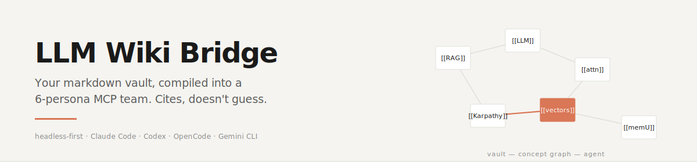

<p align="center">
  
</p>

# LLM Wiki Bridge

**把你的 markdown 笔记库编译成 6 人 MCP 虚拟团队，给 Claude Code / Codex / OpenCode / Gemini CLI 使用。Headless first。引用，不瞎编。**

[](../../LICENSE)
[](https://modelcontextprotocol.io)
[](https://github.com/2233admin/obsidian-llm-wiki/wiki)

**语言**：[English](../../README.md) · 简体中文（本页） — **指南**：[English](../GUIDE.md) · [简体中文](../GUIDE.zh-CN.md) — **Wiki**：[首页](https://github.com/2233admin/obsidian-llm-wiki/wiki) · [架构](https://github.com/2233admin/obsidian-llm-wiki/wiki/Architecture) · [立场](https://github.com/2233admin/obsidian-llm-wiki/wiki/Rationale) · [FAQ](https://github.com/2233admin/obsidian-llm-wiki/wiki/FAQ)


你 vault 里堆了 500 条笔记。一半你已经忘了。你的 AI agent 读不到它们——它只在上下文窗口里拼凑，顺手编造引用。你每天早上花 20 分钟重新翻找自己已经写过的东西。

LLM Wiki Bridge 是一个 headless-first 的 MCP 服务器，把你的 vault——wikilinks、aliases、tags、frontmatter——编译成一张概念图，让你的 agent 直接调用。Agent 不猜。它调 `vault.search`、用 `vault.read` 读被引用的笔记、用证据回答。运行时不依赖 Obsidian；filesystem adapter 永远是兜底。

概念源自 [Andrej Karpathy 的 LLM Wiki](https://github.com/karpathy/llm-wiki)。正统实现：markdown 是唯一事实来源，编译出结构，通过 MCP 暴露。

---

## 30 秒装好

```bash
git clone --depth 1 https://github.com/2233admin/obsidian-llm-wiki.git
cd obsidian-llm-wiki && ./setup                      # --host claude | codex | opencode | gemini
```

Windows（PowerShell）：

```powershell
git clone --depth 1 https://github.com/2233admin/obsidian-llm-wiki.git
cd obsidian-llm-wiki; .\setup.ps1
```

`setup` 脚本把一份 1.6 MB 的 skill 包解压到你 host 的 skills 目录，把 `.mcp.json` 片段打到屏幕让你贴进 agent 配置，然后退出。重启 agent host 之后就能看到 MCP 服务器和 6 个 `/vault-*` persona。仓库本体装完可以删——skill 是独立的。

---

## 支持哪些 host

任何讲 stdio MCP 协议的 host：

| Host | 命令 | 状态 |
|---|---|---|
| Claude Code | `./setup --host claude` | 主测试目标，全量跑过 |
| Codex CLI | `./setup --host codex` | 路径配好，冒烟过 |
| OpenCode | `./setup --host opencode` | 路径配好，冒烟过 |
| Gemini CLI | `./setup --host gemini` | 路径配好，冒烟过 |

其他讲 stdio MCP 的 host 也能用——`setup` 只是把 skill 复制到正确目录并打印 `.mcp.json` 片段。如果你的 host 从别的地方读 MCP 配置，手工把片段贴过去即可。

---

## 例子：试试这些 prompt

冷启动——完全没 vault 上下文：

```
/vault-librarian 我对 attention heads 了解多少
```

热启动——指定一条你有的笔记：

```
/vault-librarian 在我其他 LLM 笔记的上下文里，解释一下 [[retrieval-augmented-generation]]
```

指定格式——要列表不要散文：

```
/vault-historian 2026 年 1 月到 3 月之间我做了哪些关于训练数据的决策
```

迭代——精修答案：

```
/vault-curator 找出我 vault 里所有孤儿笔记和 90 天没更新的陈旧笔记
```

---

## 6 个 persona，一套 MCP 接口

每个 persona 是同一套 40 个 MCP 操作之上的一份有立场的 prompt。

| 名字 | 做什么 | 主要用的 MCP 工具 |
|---|---|---|
| vault-librarian | 读、搜、引用 vault | `vault.search`、`vault.read`、`vault.list` |
| vault-architect | 编译概念图、建议重构 | `vault.graph`、`vault.backlinks`、`compile.run` |
| vault-curator | 找孤儿、死链、重复、陈旧笔记 | `vault.lint`、`vault.searchByTag`、`vault.search` |
| vault-teacher | 把一条笔记放到邻居网络里解释 | `vault.backlinks`、`vault.read`、`vault.graph` |
| vault-historian | 回答"X 日期我当时在想什么" | `vault.searchByFrontmatter`、`vault.stat`、`vault.search` |
| vault-janitor | 提清理方案，默认 dry-run | `vault.lint`、`vault.delete`（dry）、`vault.rename`（dry） |

---

## 工作原理（30 秒版）

你的 markdown 文件——含 wikilinks `[[这样]]`、aliases、frontmatter tags、修改时间——是唯一事实来源。编译器跑一次，产出一张概念图（节点=笔记，边=链接+语义关系）。MCP 服务器把这张图暴露为工具：`vault.search`、`vault.backlinks`、`vault.graph`，以及 40+ 个其他操作。

当 Claude Code（或任何 MCP agent）调用 `/vault-librarian`，它直接调 `vault.search` 和 `vault.read`。Agent 拿到的是引用，不是猜测。

- 小规模不需要 embedding。需要语义检索的话，`memU` adapter 提供 pgvector 支持。
- 不需要数据库。默认只走文件系统；编译出的概念图以纯 JSON 缓存在 vault 旁边。
- 运行时不需要 Obsidian。`filesystem` adapter 永远可用。需要 Obsidian plugin API 的实时特性时，可以启用 Obsidian adapter（通过 WebSocket 桥接）。

---

## 深潜

Wiki 是长文答案的所在。以下 8 页是复利资产——任意顺序阅读。

| 页面 | 回答什么 |
|---|---|
| [**Rationale**](https://github.com/2233admin/obsidian-llm-wiki/wiki/Rationale) | 为什么要做这个。为什么不止是 grep，为什么不止是 Obsidian 插件，为什么不止是向量数据库，为什么不止是长上下文 LLM。诚实谈产品漂移。 |
| [**Architecture**](https://github.com/2233admin/obsidian-llm-wiki/wiki/Architecture) | 四层系统图。请求生命周期（8 步，从 `/vault-librarian` 到带引用的回答）。扩展点。 |
| [**Adapter-Spec**](https://github.com/2233admin/obsidian-llm-wiki/wiki/Adapter-Spec) | Adapter 契约、能力矩阵、fan-out 与排序、失败模式、写第五个 adapter 的 recipe。 |
| [**Compile-Pipeline**](https://github.com/2233admin/obsidian-llm-wiki/wiki/Compile-Pipeline) | 编译每阶段的产物、概念图存哪、性能参考点。 |
| [**Persona-Design**](https://github.com/2233admin/obsidian-llm-wiki/wiki/Persona-Design) | 6 个面向用户的 persona vs 17 个底层 skill。不让它们退化成一个 generic agent 的设计纪律。 |
| [**Security-Model**](https://github.com/2233admin/obsidian-llm-wiki/wiki/Security-Model) | Dry-run 默认、受保护路径、preflight 门、bearer token 传输、明确不解决的安全问题。 |
| [**Recipes**](https://github.com/2233admin/obsidian-llm-wiki/wiki/Recipes) | 内容采集器（Feishu、Gmail、Linear、X、WeChat 等）把外部源落地进 vault。 |
| [**FAQ**](https://github.com/2233admin/obsidian-llm-wiki/wiki/FAQ) | Obsidian 一定要开吗？vault 多大行？为什么 dry-run？初版答案，随着真问题出现会迭代。 |

---

## 详细安装（30 秒 quick-start 跑不通时）

见 [INSTALL.md](../INSTALL.md)。

---

## 已知局限（诚实）

- 不解读笔记里的代码——只索引文本、wikilinks、结构。需要 AST 级代码推理的话，启用可选的 `gitnexus` adapter。
- 不与 Obsidian 做实时双向同步——WebSocket adapter 需要 Obsidian 在跑。
- 不是向量数据库的替代品，大规模语义相似度请启用可选的 `memU` adapter。
- 本仓库（headless MCP）和姐妹仓 `obsidian-vault-bridge`（Obsidian 插件）的定位仍在收敛，详见 [Rationale](https://github.com/2233admin/obsidian-llm-wiki/wiki/Rationale) 页的漂移讨论。

---

## License

MIT。Fork 它。改它。让它变成你的。
